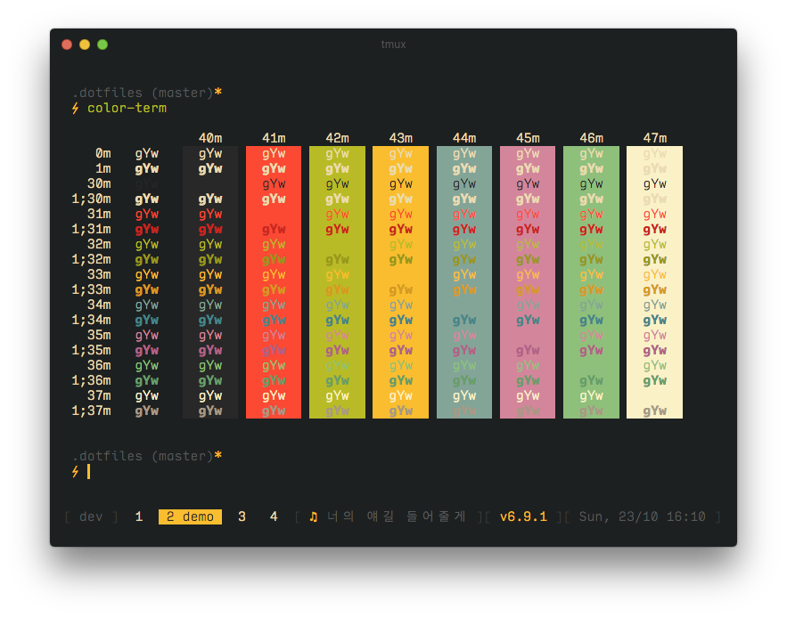

# dotfiles

dotfiles for macOS by @cusxio

## Features

- zsh with zplug

- customized ZSH prompt based on [Pure prompt](https://github.com/sindresorhus/pure)

- XDG Base Directory Support

- System Bootstrap Scripts:
    - [macOS](bootstrap/macos.sh)
    - [symlink](bootstrap/symlink.sh)
    - [node](bootstrap/node.sh)
    - [brew](bootstrap/brew.sh)
    - [python](bootstrap/python.sh)

- 24-bit Color Setup

## Installation

[mac/README.md](mac/README.md)

## Notes

This is a work in progress.